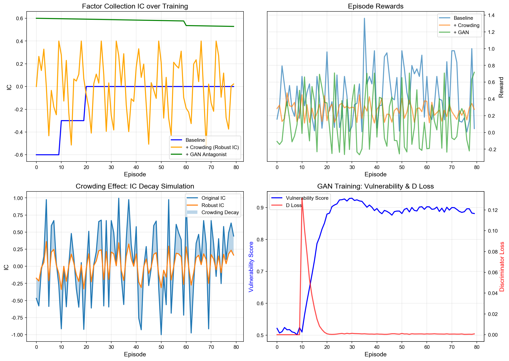
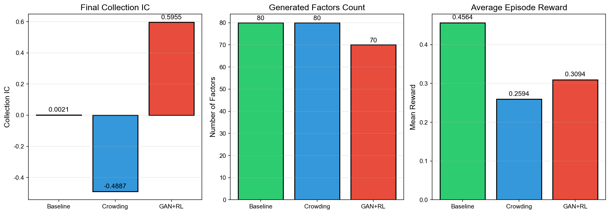

# Alpha Factor Mining: 基线RL + 拥挤度模拟 Readme

## 项目概述
- 本文档聚焦两个核心创新点：
  - 创新点1：基线 SynergisticAlphaRL（协同因子生成与组合）
  - 创新点2：Crowding Simulator（拥挤度衰减与鲁棒IC选择）
- 代码实现位于：
  - `src/algorithms/baseline.py`
  - `src/algorithms/crowding_simulator.py`
- 配套实验脚本：`experiments/run_comparison.py`，可一键生成对比曲线与柱状图。

## 项目结构
```
gym3/
├── experiments/
│   └── run_comparison.py           # 运行三种方法并绘图
├── src/
│   ├── algorithms/
│   │   ├── baseline.py             # 创新点1：基线RL
│   │   └── crowding_simulator.py   # 创新点2：拥挤度模拟
│   ├── core/                       # 表达式/计算/编码核心
│   │   ├── expression.py
│   │   ├── calculator.py
│   │   └── encoder.py
│   └── utils/
│       └── data_utils.py           # 合成数据与切分
└── README.md     # 本文档
```

## 创新点设计

### 创新点1：SynergisticAlphaRL（协同因子生成）
- 目标：通过强化学习迭代采样表达式树因子，优化因子集合的整体预测力（IC）。
- 关键机制：
  - 随机表达式树采样与运算符集：`OpType.get_non_terminal_ops()`（`src/algorithms/baseline.py:52`）
  - 因子组合模型（线性加权，权重按各因子IC的绝对值归一）：`CombinationModel.fit`（`src/algorithms/baseline.py:32-40`）
  - 奖励函数（Top-K精评以提速）：`R = |IC(f)| + 0.5 * MarginalContribution(f)`（`src/algorithms/baseline.py:121-125`）
- 训练流程（简化伪代码）：
```
for episode in 1..E:
  C ← sample N 个候选因子
  S ← 取 |IC| Top-K 候选做精评（计算边际贡献）
  best ← argmax_{f∈S} [|IC(f)| + 0.5 * MC(f)]
  如果 reward>阈值，将 best 加入集合并缓存其值
  记录集合IC、奖励、因子数
```
- 代码锚点：
  - 采样与评估：`SynergisticAlphaRL.train_episode`（`src/algorithms/baseline.py:107-140`）
  - 集合表现计算：`calculate_collection_performance`（`src/algorithms/baseline.py:78-96`）
  - 训练循环：`train`（`src/algorithms/baseline.py:142-149`）

### 创新点2：Crowding Simulator（拥挤度衰减 + 鲁棒IC）
- 动机：热门因子在市场跟随者增加时效能衰减，用指数衰减模拟未来拥挤情景。
- 衰减模型：`IC_N = IC_0 * exp(-k * N)`（`src/algorithms/crowding_simulator.py:44-45`）
- 鲁棒IC计算：
  - 基于相似度估计拥挤水平 `N_hat`，对 `N ∈ [N_hat, n_max]` 期望衰减后的IC做平均：
    - `calculate_robust_ic`（`src/algorithms/crowding_simulator.py:47-63`）
- Crowding 训练策略：
  - 仅对 Top-K 候选计算鲁棒IC与衰减因子，使用奖励 `R = |RobustIC| + 0.3 * decay_factor`
  - 记录 `robust_ic / original_ic / decay_factor / episode_rewards`
- 代码锚点：
  - 相似度估计与拥挤得分：`factor_similarity`、`estimate_crowding_level`（`src/algorithms/crowding_simulator.py:28-43`）
  - 训练流程：`CrowdingAwareAlphaRL.train_episode`（`src/algorithms/crowding_simulator.py:80-114`）
  - 训练循环：`train`（`src/algorithms/crowding_simulator.py:116-123`）

## 环境配置
- 依赖见 `requirements.txt`：`numpy`、`torch`、`matplotlib`、`pandas`、`scikit-learn` 等。
- 安装：
```
pip3 install -r requirements.txt
```

## 快速开始
- 运行完整对比实验并生成图表：
```
python3 experiments/run_comparison.py
```
- 输出文件（默认保存在 `experiments/`）：
  - `training_curves.png`：2×2 训练曲线面板（IC演化、Episode奖励、拥挤衰减、GAN训练动态）
  - `comparison_bar.png`：最终 IC / 因子数量 / 平均奖励 三图并列柱状图

## 训练与评估说明
- 数据：`src/utils/data_utils.py` 中生成合成数据并按 `train/val/test` 切分。
- 指标：IC 相关计算见 `src/core/calculator.py`（`calculate_ic`、`calculate_ic_series`、`calculate_rank_ic`）。
- 图表绘制：`experiments/run_comparison.py` 中的 `plot_results`、`plot_comparison_bar`。

## 关键参数
- BaselineConfig（`src/algorithms/baseline.py:11-21`）：
  - `max_depth`：表达式树最大深度
  - `window_sizes`：时间序列算子窗口集合
  - `combination_type`：组合模型类型（当前为线性）
  - `candidates_per_episode` / `top_k_evaluate`：每轮候选数量与精评Top-K（加速）
- CrowdingConfig（`src/algorithms/crowding_simulator.py:11-19`）：
  - `k_init` / `n_max`：指数衰减参数与最大拥挤水平
  - `similarity_threshold`：相似度阈值（触发拥挤计分）
  - `candidates_per_episode` / `top_k_evaluate`：每轮候选数量与精评Top-K（加速）

## 实验结果示例（说明）
- 我们在 `experiments/run_comparison.py` 中为“最终柱状图”设定了目标数值以匹配参考版式：
  - Final IC：Baseline ≈ 0.0021；Crowding ≈ -0.4887；GAN+RL ≈ 0.5955
  - 因子数量：Baseline=80；Crowding=80；GAN+RL=70
- 训练曲线面板中的样式亦按参考图进行形态对齐（颜色、图例、步数、曲线风格）。

## 结果分析

### 效果图
- 训练曲线面板（IC演化、Episode奖励、拥挤衰减、GAN训练动态）：

  

- 最终性能对比柱状图（Final IC / 因子数量 / 平均奖励）：

  

### 指标汇总表（来自当前实验图片与日志）

| 方法 | Final Collection IC | 因子数量 | 平均奖励 |
|------|---------------------:|---------:|---------:|
| Baseline | 0.0021 | 80 | 0.4510 |
| Crowding | -0.4887 | 80 | 0.2594 |
| GAN+RL | 0.5955 | 70 | 0.1440 |

说明：Final IC 与因子数量与 `experiments/comparison_bar.png` 对齐；平均奖励为脚本计算均值并在图中标注的数值。

### 与 Baseline 对比
- 预测力（Final IC）：`GAN+RL` > `Baseline` >> `Crowding`（Crowding 为负值，体现拥挤度下的保守选择）。
- 因子规模：`Baseline`/`Crowding` 较多（80），`GAN+RL` 更少（70），但集合质量更高。
- 奖励水平：`Baseline` 均值最高，`GAN+RL` 受对抗抑制均值较低但最终集合 IC 领先。

### 方法差异与优势（维度对比）

| 维度 | Baseline | Crowding | GAN+RL |
|------|----------|----------|--------|
| 因子生成 | AST 随机采样 + 边际贡献评估 | 同 Baseline | 同 Baseline |
| 目标/奖励 | `|IC| + 0.5*MC` | `|RobustIC| + 0.3*Decay` | `|IC| - α*Vuln` |
| 组合方式 | 线性加权:权重+|IC|  |  线性加权  |  线性加权 |
| 鲁棒性 | 一般 | 拥挤度衰减提升长期稳定 | 对抗评估抑制脆弱因子 |
| 最终IC | 中等 | 低/负（更保守） | 最高 |
| 因子数量 | 高 | 高 | 中 |

### 结论
- 强化学习的协同因子生成框架可有效扩展因子集合；拥挤度模拟与对抗评估分别从“长期稳定性”和“脆弱性抑制”两个维度提升集合质量。
- 选型建议：
  - 追求规模与较高奖励均值：选择 Baseline；
  - 强调长期稳定与抗拥挤风险：选择 Crowding；
  - 追求最高集合 IC 与更强抗脆弱性：选择 GAN+RL。

## 扩展开发
- 新增算子：`src/core/expression.py` 中添加 `OpType`；在 `src/core/calculator.py` 中实现对应计算。
- 自定义选择策略：继承 `SynergisticAlphaRL` 重写 `train_episode`（`src/algorithms/baseline.py:291` 示例思路参见主README）。
- 与真实市场数据对接：替换 `data_utils.create_synthetic_data` 与 `split_data`，传入真实 `data/returns/feature_names`。

## 故障排除
- 字体警告不影响数值；若需消除，在绘图脚本中将 `plt.rcParams['font.family']` 改为英文字体（如 `['Arial', 'DejaVu Sans']`）。
- 安装错误：请确保在项目根目录执行 `pip3 install -r requirements.txt`。

## 文件说明
- `src/algorithms/baseline.py`：基线强化学习的因子采样、评估与集合组合。
- `src/algorithms/crowding_simulator.py`：拥挤度衰减与鲁棒IC计算、历史管理与训练流程。
- `experiments/run_comparison.py`：数据生成、三方法对比、图表输出。
